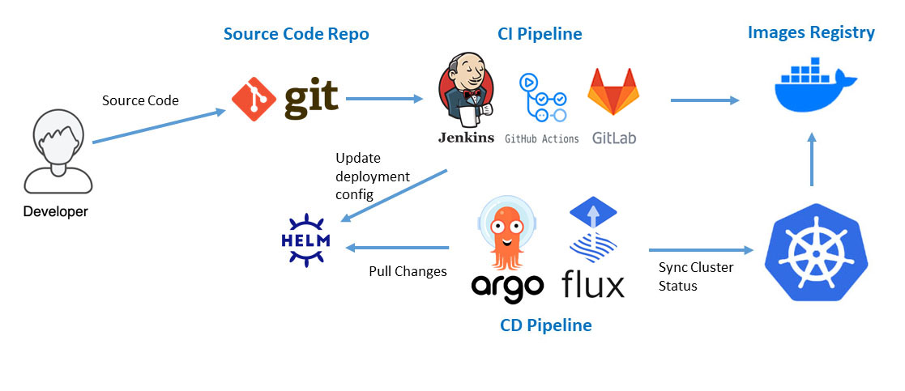

## Tbot Telegram Bot

This is a DevOps application created from scratch. It was developed to gain hands-on experience with different technologies and approaches. 

The Makefile in this repository provides information about the tools and technologies used during the development process.

## CI/CD


## Application

The application provide the possibility to create your own Telegram bot with various functionalities.

### Installation

To install the application, follow these steps:
1. Clone repository : `git clone`
2. Create new bot in Telegram
3. Add into project token variable TELE_TOKEN
```bash
export TELE_TOKEN=
```
4. Build project for any following OS with commands:

|                   | `macos` |  `linux` | `windows` |
| ----------------: | :------: |  :-----: | :---------------- |
| **`amd64`**       |  ✅      | ✅       | ✅         |
| **`arm`**         |          | ✅       | ✅         |
| **`arm64`**       | ✅       | ✅       | ✅         |

```bash
make linux64
or
make linux32
or
make macos
or
make windows
```
Build image with docker
Then run
```bash
$ ./tbot start
```

### Usage

You can send commands to the Telegram bot to interact with it.
```bash
$ /start
$ /help 
$ /start start
$ /start help
```

### Helm chart

The application can be installed in a Kubernetes cluster using a Helm chart.
```bash
$ helm install tbot ./helm --set secret.secretValue=${TELE_TOKEN}
or
$ make hinstall

$ helm template tbot ./helm --set secret.secretValue=${TELE_TOKEN}
or
$ make htemplate
```

## CI/CD 

### Deploy using Helm into a local k3d cluster, with or without ArgoCD.

```bash
# k3d with ArgoCD
$ make deploy
or
# k3d without ArgoCD
$ make dep
```

### Deploy using Terraform with Flux into a local kind cluster or GKE.

```bash
# kind
$ ENV=kind make tapply
or
# gke
$ ENV=gke make tapply
```

### Examples of automation workflows - GitHub Actions, GitLab CI/CD and Jenkins.
 ```bash
# jenkins
$ cat pipeline/jenkins.groovy

# GitLab CI/CD
$ cat gitlab-ci.yml

# GitHub Actions
$ cat .github\workflows\cicd.yml
```

## Monitoring 
Monitoring on K8s cluster with Flux - OpenTelemetry + Prometheus + Fluentbit + Grafana + Loki
 ```bash
$ make compose_up
or
$ docker-compose -f otel/docker-compose.yaml up
```